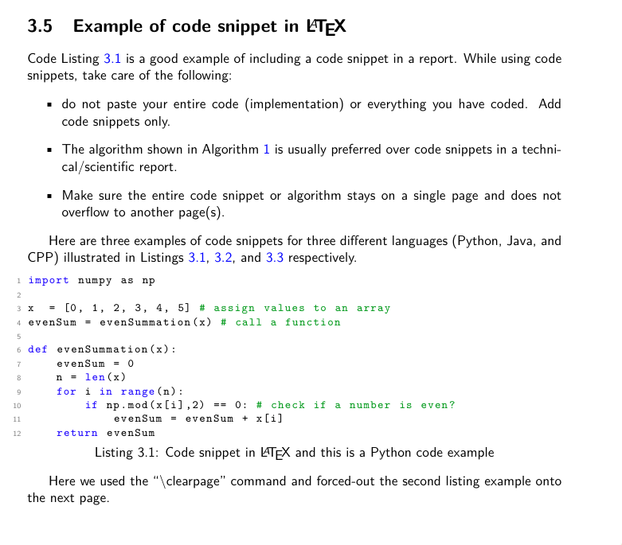
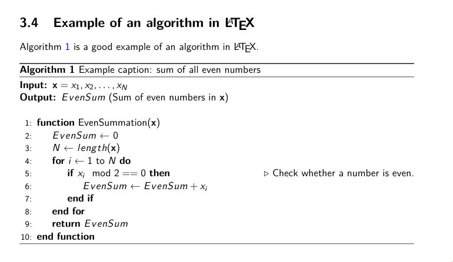
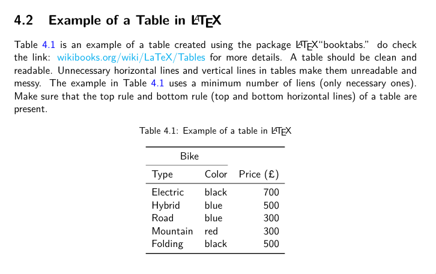

# Sobre o repositório

## Sumário

<!--toc:start-->
- [$\LaTeX$](#latex)
  - [Main](#main)
  - [Escrevendo](#escrevendo)
    - [Codeblock](#codeblock)
    - [Pseudocódigo](#pseudocódigo)
    - [Tabela](#tabela)
  - [Compilação](#compilação)
- [Arquivos de código](#arquivos-de-código)
  - [Rust](#rust)
  - [C++](#c)
<!--toc:end-->

## $\LaTeX$

A partir de uma decisão democrática (minha), resolvemos fazer esse trabalho em $\LaTeX$ com todas as suas dependências nesse repositório, então, nas próximas linhas vou passar algumas utilidades para a gente trabalhar direitinho e tirar um 10 nesse troço.

### Main

O nosso código em Latex está organizado da seguinte forma:

```plain-text
.
├── chapters
│   ├── 01_introduction.tex
│   ├── 02_literature.tex
│   ├── 03_methodology.tex
│   ├── 04_results.tex
│   ├── 05_discussion.tex
│   ├── 06_conclusions.tex
│   └── 07_reflection.tex
├── figures
│   ├── chart.pdf
│   └── ufrnlogo.png
├── CS_report.sty
├── main.tex
└── references.bib
```

No `main.tex`, está o esqueleto do projeto, como o import do pacote `CS_report.sty` que contém definições, configurações relacionadas ao projeto, página inicial, integrantes do grupo, etc. Além disso, contém a chamada dos arquivos de outras seções do documento, com:

```latex
    \input{chapters/01_introduction}
    \input{chapters/02_literature} % https://guides.library.bloomu.edu/litreview
    \input{chapters/03_methodology}
    \input{chapters/04_results}
    \input{chapters/05_discussion}
    \input{chapters/06_conclusions}
    \input{chapters/07_reflection}
```

E aí quando for escrever uma seção, basta adicionar aqui ou modificar um existente.

### Escrevendo

Latex é uma linguagem relativamente simples e possui muita documentação sobre, sempre uso o <https://www.overleaf.com/learn/latex/Tutorials> para consultar sintaxe e o que desejo fazer, o chatGPT ajuda também, mas ele é um pouquinho besta pra $\LaTeX$.

Nesse trabalho vai ser necessário escrever **código**, **pseudocódigo** e listar os resultados de performance obtidos numa tabela por exemplo, para isso, podemos seguir esses exemplinhos.

#### Codeblock

##### Documento



##### Código

```latex
\begin{lstlisting}[language=Python, caption={Code snippet in \LaTeX ~and  this is a Python code example}, label=list:python_code_ex]
import numpy as np

x  = [0, 1, 2, 3, 4, 5] # assign values to an array
evenSum = evenSummation(x) # call a function

def evenSummation(x):
    evenSum = 0
    n = len(x)
    for i in range(n):
        if np.mod(x[i],2) == 0: # check if a number is even?
            evenSum = evenSum + x[i]
    return evenSum
\end{lstlisting}
```

#### Pseudocódigo

##### Documento



##### Código

```latex
\begin{algorithm}
    \caption{Example caption: sum of all even numbers}
    \label{algo:algo_example}
    \begin{algorithmic}[1]
        \Require{$ \mathbf{x}  = x_1, x_2, \ldots, x_N$}
        \Ensure{$EvenSum$ (Sum of even numbers in $ \mathbf{x} $)}
        \Statex
        \Function{EvenSummation}{$\mathbf{x}$}
        \State {$EvenSum$ $\gets$ {$0$}}
        \State {$N$ $\gets$ {$length(\mathbf{x})$}}
        \For{$i \gets 1$ to $N$}                    
        \If{$ x_i\mod 2 == 0$}  \Comment Check whether a number is even.
        \State {$EvenSum$ $\gets$ {$EvenSum + x_i$}}
        \EndIf
        \EndFor
        \State \Return {$EvenSum$}
        \EndFunction
    \end{algorithmic}
\end{algorithm}
```

#### Tabela

##### Documento



##### Código

```latex
\begin{table}[h!]
    \centering
    \caption{Example of a table in \LaTeX}
    \label{tab:_ex_tab}
    \begin{tabular}{llr}     
        \toprule
        \multicolumn{2}{c}{Bike} \\
        \cmidrule(r){1-2}
        Type    &  Color & Price (\pounds) \\
        \midrule
        Electric    & black   & 700   \\
        Hybrid      & blue    & 500   \\
        Road        & blue    & 300   \\
        Mountain    & red     & 300   \\
        Folding     & black   & 500   \\
        \bottomrule
    \end{tabular}
\end{table}
```

### Compilando

Particularmente eu uso o plugin <https://github.com/lervag/vimtex> no neovim com a opção:

```lua
vim.g.vimtex_compiler_latexmk = {
  out_dir = "output",
}
```

Para gerar os arquivos de compilação dentro da pasta relativa `output`. E aí enquanto escrevo e salvo o neovim já me mostra o pdf em tempo real enquanto edito o texto.

Algumas alternativas para codar e compilar latex seriam:

- **Usar o [Latex Workshop](https://github.com/James-Yu/LaTeX-Workshop) no vscode**.

  > Tutorial prático de como configurar: <https://mathjiajia.github.io/vscode-and-latex/>

- **Usar o overleaf e depois copiar de volta pro repositório**.

  > Basta ir em New project > Blank Project, uploada tudo que tem na pasta latex pro overleaf e edita por lá.

- **Compilar manualmente e verificar o pdf**.
  > Para isso, deixei um `Makefile` dentro da pasta `latex`. Basta executar `make` e o resultado vai estar em `output`

Se for usar o Latex Workshop no vscode, lembre de especificar o diretório que terá o resultado da compilação (`output`), se não os arquivos não vão ser barrados pelo `.gitignore`.

## Arquivos de código

Os arquivos de código que contem as implementações requeridas estão na pasta `src/`, em Rust estão sendo implementados os algoritmos de ordenação e em C++ foram implementados os `idadeRep` e provavelmente serão implementados os códigos de busca.

Antes que me julguem por colocar Rust no meio, o código no estado atual (2024-10-23 22:13), já existia desde muito tempo, então só reaproveitei e implementei a parte que analisa a performance.

### Rust

#### Rodando

Pra rodar basta executar dentro da pasta `rust`:

```terminal
cargo run
```

E aí ele vai exibir o tempo gasto para processar listas de 10 as 10000, entradas.

#### Implementando

Caso no momento em que esteja lendo ainda esteja faltando algo a se implementar, tente fazer em Rust! Não é muito complicado e é relativamente simples de criar e realizar testes, além de compilar e executar o projeto (cof cof cmake). Vá no arquivo `src/rust/src/algorithms.rs` implemente alguma função que o trabalho pede e crie uma função de teste no modulo de teste no mesmo arquivo. Olha o *insertion sort* como exemplo:

**Implementação**:

```rust
pub fn insertion_sort<T: PartialOrd>(arr: &mut [T]) {
  for i in 1..arr.len() {
    let mut j = i;
    while j > 0 && arr[j] < arr[j - 1] {
      arr.swap(j, j - 1);
      j -= 1;
    }
  }
}
```

> Esse `PartialOrd` é para exigir que o tipo genérico `T` implemente o `<` e `≤`.

**Testes**:

```rust
#[cfg(test)]
mod tests {
  #[test]
  fn test_insertion_sort() {
    let mut arr = [5, 3, 2, 4, 1];
    insertion_sort(&mut arr);
    assert_eq!(arr, [1, 2, 3, 4, 5]);
  }
}
```

Uma vez feito isso, basta executar:

```terminal
cargo test
```

E todos os testes que você definiu vão ser executados! E aí para testar a performance do teu sort, basta ir na `main` em `main.rs` e adicionar a função nessa listinha:

```rust

fn main() {
  let sort_functions = Vec::from([
    ("SELECTION SORT", selection_sort as SortFn<i32>),
    ("BUBBLE SORT", bubble_sort),
    ("INSERTION SORT", insertion_sort), // <- Aqui tua função!
    ("QUICK SORT", quick_sort),
  ]);

  let title = "Performance test for sort algorthms";
  println!("{}\n{}\n", title, "=".repeat(title.len()));

  for n in 1..=4 {
    run_entry(&sort_functions, TEN.pow(n));
  }
  // run_entry(&sort_functions, ENTRY_SIZE);
}
```

> Com `cargo run` tu consegue ver a esse programa executando.

### C++

Por enquanto (2024-10-23 22:46), só existe a `main.cpp` com as funções `idadeRep`, então basta seguir o procedimento de compilar padrão com o `gcc` ou `clang` e executar o binário.

Se houver a necessidade de criação de um `cmake`, vou atualizar aqui esse tópico.

# To-do

## 1. Análise Teórica

- [ ] 1.0 Deve ser feita a descrição das funções/procedimentos utilizados e uma explicação do funcionamento geral para o algoritmo (pseudocódigo), buscando justificar o resultado esperado em todos os casos possíveis (explicar porque o seu algoritmo funciona).
- [ ] 1.1 Estabeleça pseudocódigos para o algoritmo de ordenação BubbleSort em versões iterativa e recursiva e analise a complexidade em relação as notações Big O, ômega e Theta. Para a versão recursiva, utilize os 4 métodos vistos.
- [ ] 1.2 Estabeleça pseudocódigos para o algoritmo de ordenação MergeSort em versões iterativa e recursiva e analise a complexidade em relação as notações Big O, ômega e Theta. Para a versão recursiva, utilize os 4 métodos vistos.
- [ ] 1.3 Estabeleça pseudocódigos para o algoritmo de ordenação QuickSort em versões iterativa e recursiva e analise a complexidade em relação as notações Big O, ômega e Theta. Para a versão recursiva, utilize os 4 métodos vistos.

## 2. Fase de análise de algoritmo

- [ ] 2.0 Descreva o ambiente computacional utilizado (Software e Hardware).
- [ ] 2.1 Função iterativa
  - [x] 2.1.A Implemente os códigos idadeRep e idadeRep2, vistos em sala de aula. **(Oaks)**
  - [ ] 2.1.B Crie instâncias aleatórias com idades (inteiros) variando entre 0 e 100, com tamanhos n=100, n=1.000, n=10.000.
  - [ ] 2.1.C Compute os tempos de processamento e compare com os resultados da análise assintótica vista em sala.
- [ ] 2.2 Função recursiva
  - [ ] 2.2.A Implemente os códigos buscaBinaria e bBinRec, vistos em sala de aula.
  - [ ] 2.2.B Crie instâncias aleatórias com idades (inteiros) variando entre 0 e 100, com tamanhos n=100, n=1.000, n=10.000.
  - [ ] 2.2.C Compute os tempos de processamento e compare com os resultados da análise assintótica vista em sala.
- [x] 2.3 Implemente os algoritmos de ordenação baseados nos pseudocódigos que você sugeriu nos itens 1.A, 1.B e 1.C, em suas versões iterativa e recursiva. **(Lims)**
- [x] 2.4 Crie listas aleatórias, com inteiros variando entre 0 e 1000, de tamanho 1.000, 10.000 e 100.000(salve as listas em arquivo txt).
- [x] 2.5 Execute os algoritmos de ordenação (BubbleSort, MergeSort e QuickSort, iterativo e recursivo) nas listas, salve o resultado da lista ordenada em um arquivo txt, e compute o tempo de processamento para cada caso. Faça o tabelamento dos resultados, e realize uma análise detalhada. Esta análise deve constar no arquivo PDF enviado.

## 3. Formalizar no Latex

- [ ] 1.0 marina
- [ ] 1.1 marina
- [ ] 1.2 lime
- [ ] 1.3 lime
- [ ] 2.0
- [ ] 2.1 oaks
  - [ ] 2.1.A oaks
  - [ ] 2.1.B oaks
  - [ ] 2.1.c oaks
- [ ] 2.2
  - [ ] 2.2.A
  - [ ] 2.2.B
  - [ ] 2.2.C
- [ ] 2.3 lime
- [ ] 2.4 lime
- [ ] 2.5 lime

---
&copy; IMD/UFRN 2024
